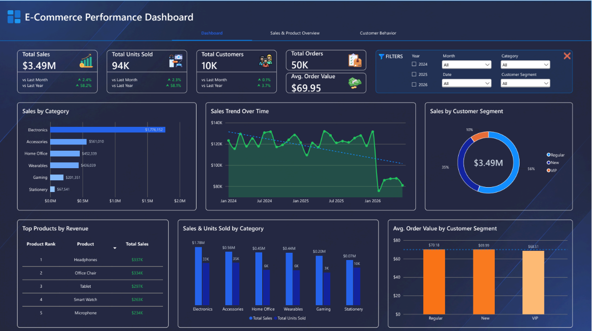
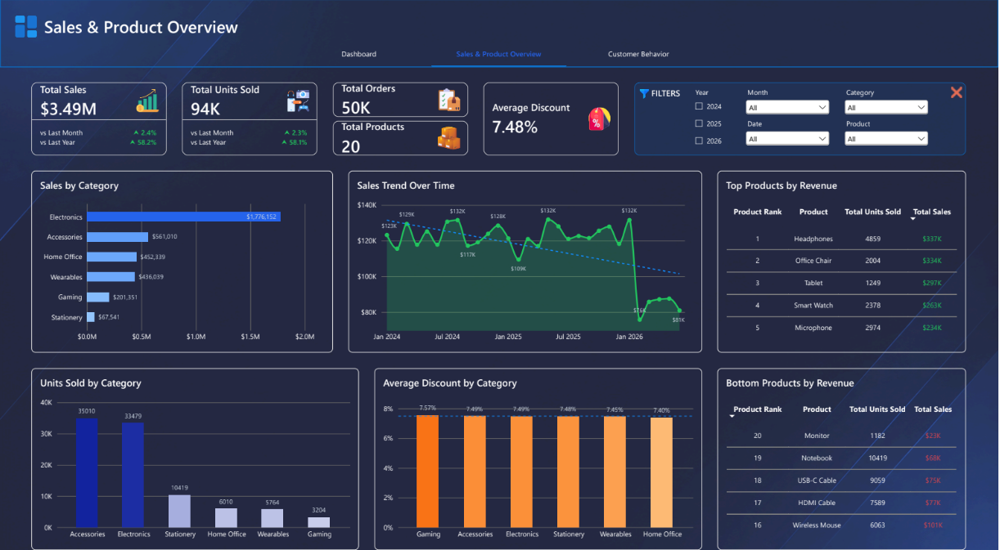
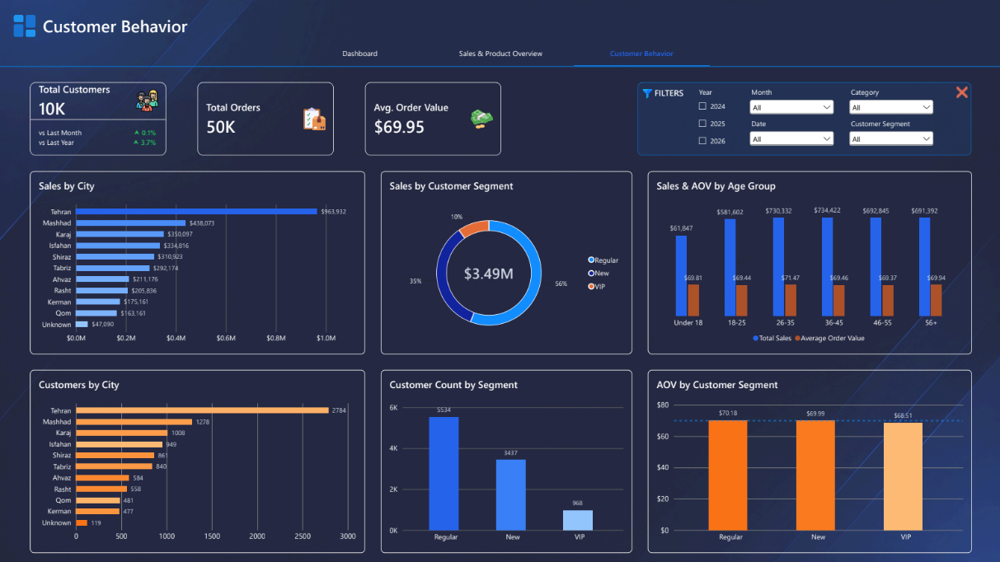

# E-Commerce Performance Dashboard

> Interactive e-commerce performance dashboard developed using Microsoft Power BI to analyze sales performance, product trends, and customer behavior.

> **Project Type:** TESDA Data Analytics Level III – Individual Assessment
> **Assessment:** Individual Assessment
> **Status:** Completed
> **Dataset Source:** Kaggle
> **Dashboard:** Microsoft Power BI

---

## Overview

The E-Commerce Performance Dashboard was developed as an **individual assessment for the TESDA Data Analytics Level III program**.

The project transforms retail transaction data into an interactive business intelligence dashboard using Microsoft Power BI.

The dashboard provides insights into overall e-commerce performance through key performance indicators, sales trends, product analysis, and customer behavior.

The project consists of three dashboard pages, each focusing on a different aspect of the business:

* **Dashboard Overview** – High-level business performance and key metrics
* **Sales & Product Overview** – Sales trends and product performance
* **Customer Behavior** – Customer activity and purchasing behavior

Interactive slicers and visualizations allow users to explore the data across different time periods, product categories, customers, and other dimensions.

---

# Features

* 📊 Interactive e-commerce dashboard
* 💰 Total sales analysis
* 🛒 Total orders monitoring
* 👥 Unique customer analysis
* 📦 Product performance analysis
* 🏷️ Sales by category
* 📈 Sales trend analysis
* 📅 Time-based analysis
* 📊 Month-over-Month (MoM) growth
* 📈 Year-over-Year (YoY) growth
* 💵 Average Order Value (AOV)
* 🔎 Interactive slicers and filters
* 📌 KPI cards
* 📊 Customer behavior analysis
....

---

# Technologies Used

### Data Analytics

* Microsoft Power BI
* Power Query
* DAX
* Data Modeling

### Dataset

* Retail Sales Dataset
* Kaggle

---

# Dashboard Pages

## 1. Dashboard Overview

*Provides a high-level overview of e-commerce performance through key metrics, trends, and interactive visualizations.*



---

## 2. Sales & Product Overview

*Provides detailed analysis of sales performance and product activity, including sales trends, category performance, and product-level insights.*



---

## 3. Customer Behavior

*Analyzes customer activity and purchasing behavior to provide insights into customer engagement and overall customer performance.*



---

# Data Preparation

The retail sales dataset was prepared using Power Query before being used to develop the dashboard.

The data preparation process included:

* Removing duplicate records
* Handling missing values
* Standardizing inconsistent text values
* Correcting data types
* Removing invalid records
* Preparing date fields for time-based analysis
* Reviewing data quality
* Establishing relationships between tables

The cleaned data was then loaded into Power BI and structured for analysis.

---

# Data Model

The Power BI data model consists of several related tables used to support the dashboard analysis.

### Main Tables

* **Customers**
* **Orders**
* **Products**
* **Payments**
* **Calendar**

Relationships between the tables allow sales, orders, customers, products, and payment information to be analyzed together.

---

# DAX Measures

DAX was used to create calculated measures for the dashboard's KPIs and analytical metrics.

### Total Sales

```DAX
Total Sales =
SUMX(
    'orders',
    'orders'[Quantity] *
    RELATED(products[UnitPrice]) *
    (1 - 'orders'[Discount])
)
```

### Cancellation Rate

```DAX
Total Products = DISTINCTCOUNT('products'[ProductID])
```

Additional DAX measures were created for customer counts, order metrics, average order value, MoM growth, YoY growth, and other dashboard calculations.

---

# Dashboard Design

The dashboard was designed using a dark, modern visual style with a focus on readability, consistency, and clear presentation of business metrics.

The design includes:

* KPI cards for important metrics
* Interactive slicers
* Sales trend visualizations
* Product and category comparisons
* Customer behavior analysis
* MoM and YoY performance indicators
* Consistent visual formatting
* Business-focused data storytelling

The three-page structure separates the analysis into clear sections while allowing users to interact with the data through common filters.

---

# Skills Demonstrated

* Power BI
* Power Query
* DAX
* Data Cleaning
* Data Transformation
* Data Modeling
* Data Visualization
* Business Intelligence
* KPI Development
* Time-Series Analysis
* Customer Analysis
* Product Analysis
* Dashboard Design
* Data Storytelling

---

# Assessment Context

This project was completed as an **individual assessment for the TESDA Data Analytics Level III program**.

The assessment provided an opportunity to demonstrate practical data analytics skills through the preparation, analysis, modeling, and visualization of a retail/e-commerce dataset.

The project demonstrates the application of:

* Data preparation and cleaning
* Data transformation
* Data modeling
* DAX calculations
* Data visualization
* Dashboard development
* Business analysis
* Analytical storytelling

---

# Dataset

**Dataset:** Retail Sales Dataset

**Kaggle Author:** abbas829

**Source:** Kaggle

[View the Retail Sales Dataset on Kaggle](https://www.kaggle.com/datasets/abbas829/retail-sales-dataset)

The original dataset is not included in this repository. Please refer to the original Kaggle page for the dataset and its licensing information.

---

# Repository Structure

```text
ecommerce-performance-powerbi-dashboard/
│
├── README.md
├── images/
│   ├── dashboard-overview.png
│   ├── sales-product-overview.png
│   └── customer-behavior.png
│
└── E-Commerce-Performance-Dashboard.pbix
```

---

# Disclaimer

This repository is intended to showcase the project for portfolio purposes.

This project was completed as an **individual assessment for the TESDA Data Analytics Level III program** using a publicly available dataset from Kaggle.

The dataset remains the property of its original creator. The Power BI file and project documentation are provided for educational, assessment, and portfolio purposes.
